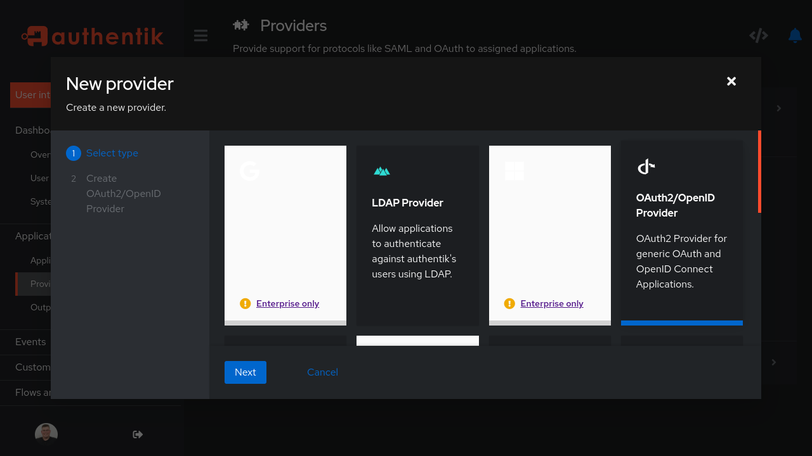
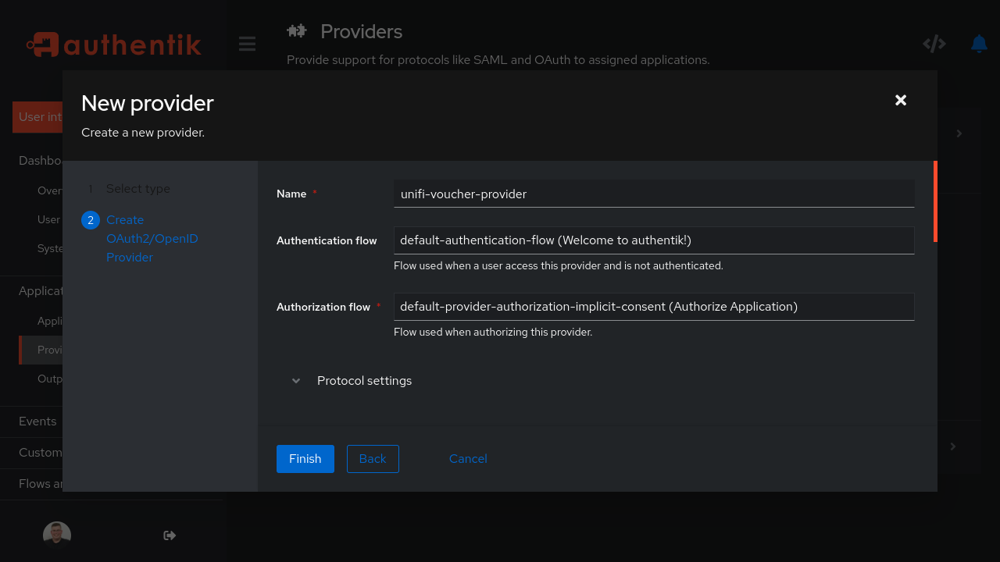
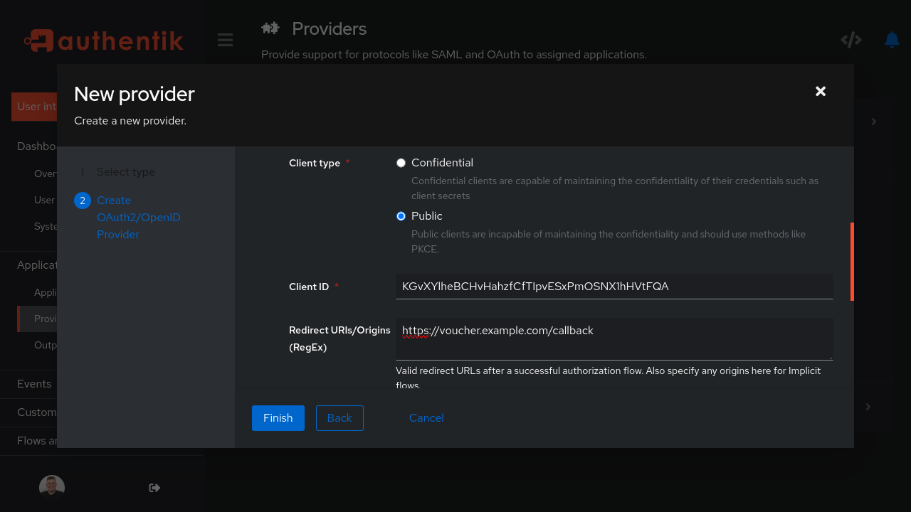
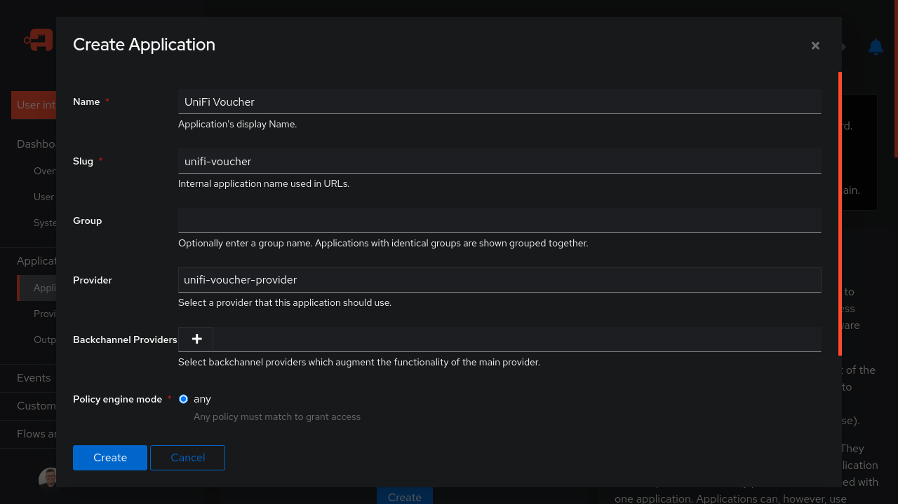

# Authentik OIDC

## 1. Authentik Application Configuration

### Step 1: Log in to the Authentik Admin Interface

1. Access the Authentik admin interface (e.g., `https://auth.example.com/if/admin`).
2. Log in with your admin credentials.

### Step 2: Create a Provider

1. Go to **Providers** in the left-hand menu.
2. Click **Create Provider**.
3. Choose **OAuth2/OpenID Connect Provider** as the provider type.
4. Set the following fields:
    - **Name**: `unifi-voucher-provider`.
    - **Authentication flow**: `default-authentication-flow`.
    - **Authorization flow**: `default-provider-authorization-implicit-consent`.
    - **Client Type**: Select `confidential`, A client secret will be generated.
5. Set the **Redirect URI** to match your UniFi Voucher Site’s callback URL (e.g., `https://voucher.example.com/oidc/callback`).
6. Click **Submit**.

> After saving, note down the **Client ID** and **Client Secret** generated for this provider. You’ll need it when configuring your UniFi Voucher Site.

### Step 3: Create a New Application

1. Go to **Applications** in the left-hand menu.
2. Click **Create Application**.
3. Fill in the following fields:
    - **Name**: `UniFi Voucher` (You can choose any relevant name).
    - **Slug**: This is a URL-friendly identifier (e.g., `unifi-voucher`).
    - **Provider**: Select the provider you created in step 2 (e.g., `unifi-voucher-provider`).
4. Click **Submit** to save.

---

## 2. UniFi Voucher Site Configuration

Now, configure your UniFi Voucher Site to use the Authentik client.

1. Set the `AUTH_OIDC_CLIENT_ID` as configured in Authentik (found in the Authentik provider configuration).
2. Provide the `AUTH_OIDC_CLIENT_SECRET` (found in the Authentik provider configuration).
3. Provide the `AUTH_OIDC_ISSUER_BASE_URL` from your Authentik provider.
    - You can find this under **Providers > unifi-voucher-provider > OpenID Configuration URL** in Authentik.
4. Provide the `AUTH_OIDC_APP_BASE_URL` from your UniFi Voucher Site instance (e.g., `https://voucher.example.com`).
5. Restart the container after these changes

---

## 3. Testing and Troubleshooting

1. Test the login flow from your UniFi Voucher Site. Ensure it redirects to Authentik for authentication.
2. After logging in, the user should be redirected back to the voucher site with the appropriate tokens.

### Common Issues

- **Invalid Redirect URI**: Ensure the callback URI matches what is configured in Authentik.
- **Client Secret Errors**: Double-check the client secret in both Authentik and your UniFi configuration.
