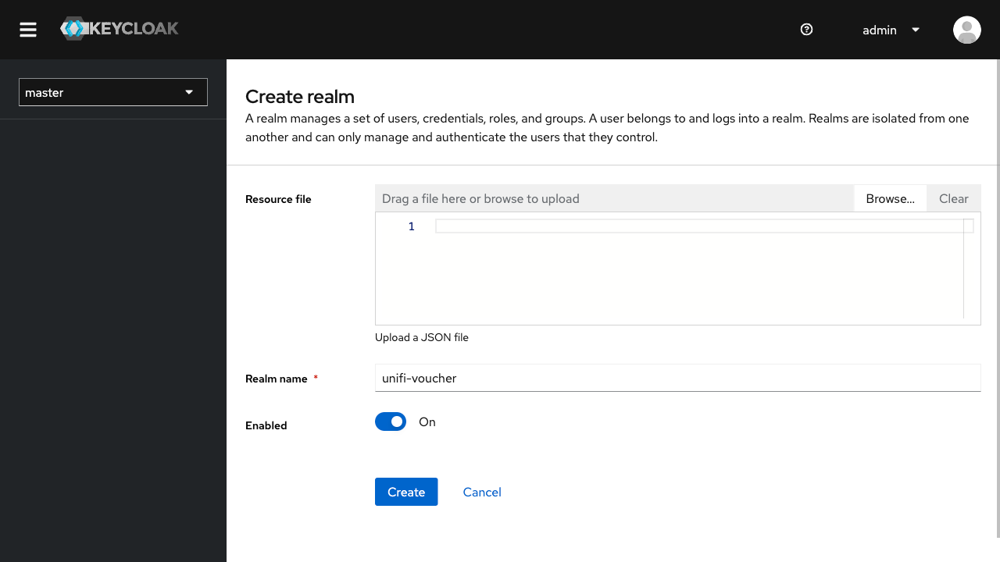
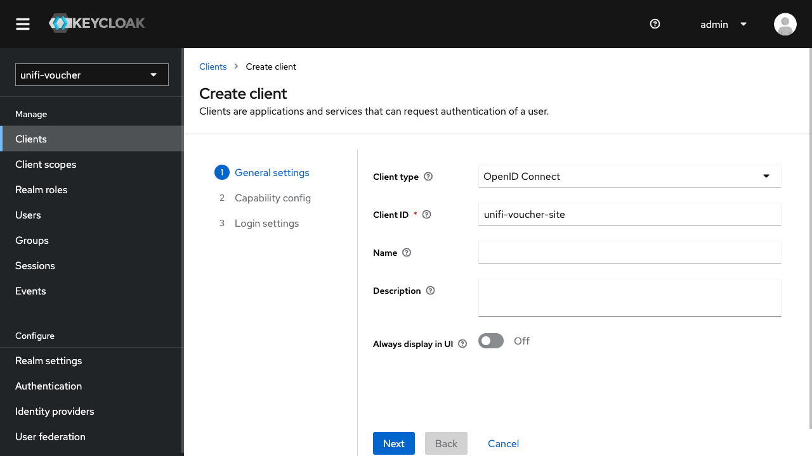
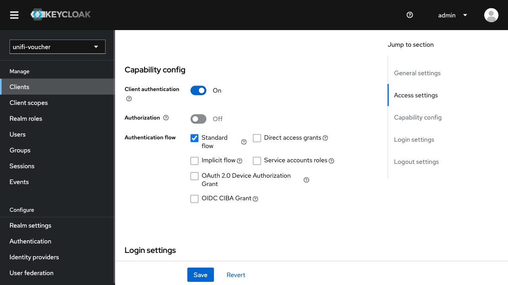
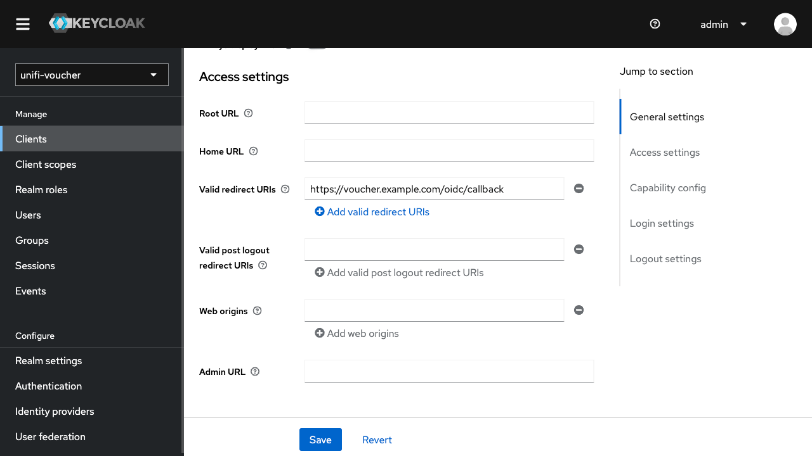
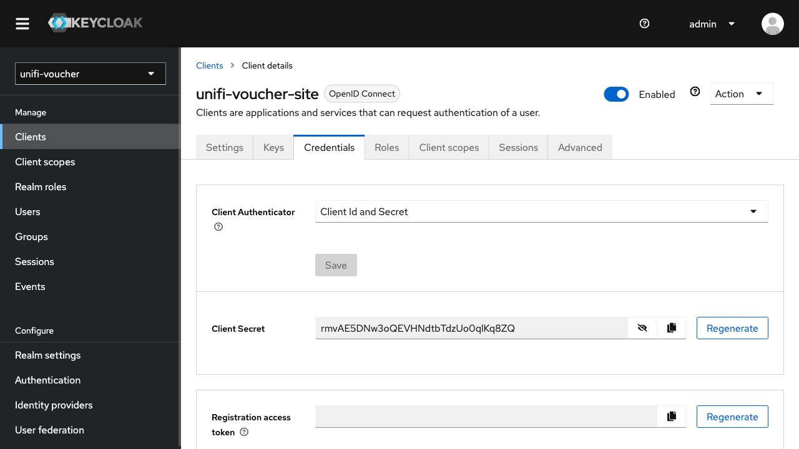

# Keycloak OIDC

## 1. Keycloak Client Configuration

### Step 1: Log in to the Keycloak Admin Console

1. Go to your Keycloak admin console (e.g., `https://auth.example.com/`).
2. Log in with your admin credentials.

### Step 2: Create a New Realm (Optional)

If you don't already have a realm:

1. Click **Add Realm** in the left-hand menu.
2. Name your realm (e.g., `unifi-voucher`).
3. Save the realm.

### Step 3: Create a Client

1. Inside your realm, go to **Clients** in the left-hand menu.
2. Click **Create**.
3. Fill in the following fields:
    - **Client ID**: `unifi-voucher-site` (You can choose any name relevant to your UniFi Voucher Site).
    - **Client Protocol**: `openid-connect`.
    - Click **Save**.

### Step 4: Configure the Client

You’ll see various tabs for configuring the client. Set the following fields:

1. Go to the **Settings** tab.
2. Set **Access Type** to `confidential`.
3. Ensure **Standard Flow Enabled** is set to `ON`.
4. Set **Valid Redirect URIs** to your UniFi voucher callback URL (e.g., `https://voucher.example.com/callback`).
5. Click **Save**.

6. After saving, go to the **Credentials** tab to get the **Client Secret**. This secret will be used by your UniFi Voucher Site when authenticating as a confidential client.

---

## 2. UniFi Voucher Site Configuration

Now, configure your UniFi Voucher Site to use the Keycloak client.

1. Set the `AUTH_OIDC_CLIENT_ID` as configured in Keycloak (e.g., `unifi-voucher-site`).
2. Provide the `AUTH_OIDC_CLIENT_SECRET` (found in the Credentials tab in Keycloak).
3. Provide the `AUTH_OIDC_ISSUER_BASE_URL` from your Keycloak server (e.g., `https://auth.example.com/realms/{realm}/.well-known/openid-configuration`).
4. Provide the `AUTH_OIDC_APP_BASE_URL` from your UniFi Voucher Site instance (e.g., `https://voucher.example.com`).
5. Restart the container after these changes

---

## 3. Testing and Troubleshooting

1. Test the login flow from your UniFi Voucher Site. Ensure it redirects to Keycloak for authentication.
2. After logging in, the user should be redirected back to the voucher site with the appropriate tokens.

### Common Issues

- **Invalid Redirect URI**: Ensure the callback URI matches what is configured in Keycloak.
- **Client Secret Errors**: Double-check the client secret in both Keycloak and your UniFi configuration.
