# UniFi Voucher Site

UniFi Voucher Site is a web-based platform for generating and managing UniFi network guest vouchers

[](https://github.com/glenndehaan/unifi-voucher-site/commits/master/) [](https://hub.docker.com/r/glenndehaan/unifi-voucher-site) [](https://crowdin.com/project/unifi-voucher-site)

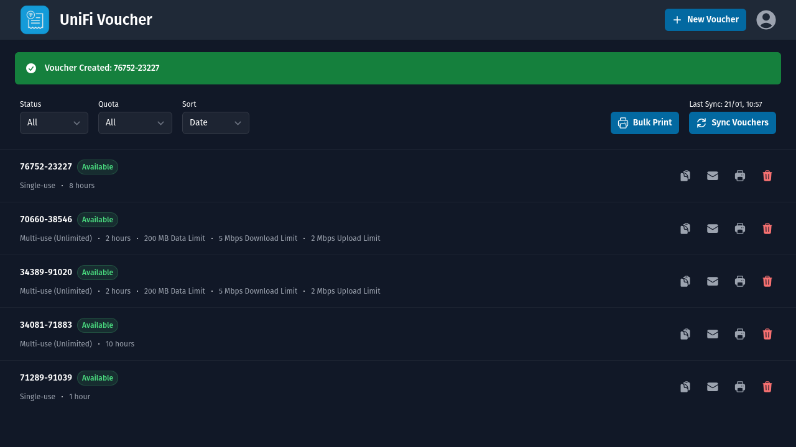

> Upgrading from 6.x to 7.x? Please take a look at the [migration guide](#migration-from-6x-to-7x)

---

## Features

- **Voucher Management**: Create, view, and manage vouchers with customizable options for expiration, data limits, and speeds.
- **OIDC Support**: Integrates OpenID Connect for secure user authentication and single sign-on (SSO).
- **Web and API Services**: Access the service via a web interface or integrate with other systems using a REST API.
- **Docker Support**: Easily deploy using Docker, with customizable environment settings.
- **Home Assistant Add-on**: Seamlessly integrate with Home Assistant for centralized management.
- **Receipt Printing**: Supports printing vouchers with 80mm thermal printers. Via compatible PDFs and/or ESC/POS enabled network printers.
- **Bulk Printing**: Export/print multiple Vouchers in one go.
- **Email Functionality**: Automatically send vouchers via SMTP.
- **Localized Email/Print Templates** Fully localized templates, with support for multiple languages.
- **Scan to Connect QR Codes** Quickly connect users via a phone's camera. (Available within Email and Print Layouts)

---

## Structure

- Node.js
- ExpressJS
- EJS
- Node UniFi
- TailwindCSS
- NodeMailer
- PDFKit
- Node Thermal Printer
- QRCode

---

## Prerequisites

- UniFi Network Controller (Cloud Key, Dream Machine, or Controller software)
- UniFi Access Point (AP)
- UniFi Local Account with 'Full Management' access

[Follow this guide to set up the Hotspot Portal](https://help.ui.com/hc/en-us/articles/115000166827-UniFi-Hotspot-Portal-and-Guest-WiFi), then continue with the installation below

> Ensure voucher authentication is enabled within the Hotspot Portal

> Attention!: We recommend only using Local UniFi accounts due to short token lengths provided by UniFi Cloud Accounts. Also, UniFi Cloud Accounts using 2FA are not supported!

> Note: When creating a Local UniFi account ensure you give 'Full Management' access rights to the Network controller. The 'Hotspot Role' won't give access to the API and therefore the application will throw errors.

---

## Installation

### Docker

You can easily run UniFi Voucher Site using Docker. We provide two release tracks to ensure you have flexibility in how you manage your deployments:

- **Master Branch**: The `latest` Docker tag is always built from the `master` branch. This tag contains the most recent changes, but may also include experimental or less stable features.
- **Tag-based Versions**: For production environments, we recommend using tag-based versions. These tags correspond to specific, stable releases of the application. To use a tag-based version, simply replace `latest` with the desired version number.

**Below is an example docker-compose.yml file that can help you get started:**

```yaml
services:
  unifi-voucher-site:
    image: glenndehaan/unifi-voucher-site:latest
    ports:
      - "3000:3000"
    environment:
      # The IP address to your UniFi OS Console
      UNIFI_IP: '192.168.1.1'
      # The port of your UniFi OS Console, this could be 443 or 8443
      UNIFI_PORT: 443
      # The username of a local UniFi OS account
      UNIFI_USERNAME: 'admin'
      # The password of a local UniFi OS account
      UNIFI_PASSWORD: 'password'
      # The UniFi Site ID
      UNIFI_SITE_ID: 'default'
      # The UniFi SSID where guests need to connect to (Used within templating and 'Scan to Connect')
      UNIFI_SSID: ''
      # The UniFi SSID WPA/WPA2/WPA3 Password (Can be ignored for 'Open' networks) (Used within templating and 'Scan to Connect')
      UNIFI_SSID_PASSWORD: ''
      # Toggle to enable/disable internal authentication
      AUTH_INTERNAL_ENABLED: 'true'
      # The password used to log in to the voucher portal Web UI
      AUTH_INTERNAL_PASSWORD: '0000'
      # The Bearer token used for the API
      AUTH_INTERNAL_BEARER_TOKEN: '00000000-0000-0000-0000-000000000000'
      # Toggle to enable/disable OIDC authentication
      AUTH_OIDC_ENABLED: 'false'
      # OIDC issuer base url provided by oauth provider. Example: https://auth.example.com/.well-known/openid-configuration
      AUTH_OIDC_ISSUER_BASE_URL: ''
      # OIDC UniFi Voucher base url (This application). Example: https://voucher.example.com
      AUTH_OIDC_APP_BASE_URL: ''
      # OIDC client id provided by oauth provider
      AUTH_OIDC_CLIENT_ID: ''
      # OIDC client secret provided by oauth provider
      AUTH_OIDC_CLIENT_SECRET: ''
      # In campus environments with multiple organizations sharing a single UniFi Controller instance, it may be desirable to limit voucher administrators to managing only vouchers associated with their own organization.
      # This restriction is based on the domain part of the administrator's email address.
      # When enabled, the system automatically assigns the administrator’s email domain as a note to each created voucher.
      # The voucher will contain both the email domain and any user-provided note.
      # Vouchers without a domain note will be hidden from all users.
      PIN_OIDC_USER_TO_OWN_DOMAIN: 'false'
      # Disables the login/authentication for the portal and API
      AUTH_DISABLE: 'false'
      # Voucher Types, format: expiration in minutes (required),single-use or multi-use vouchers value - '0' is for multi-use (unlimited) - '1' is for single-use - 'N' is for multi-use (Nx) (optional),upload speed limit in kbps (optional),download speed limit in kbps (optional),data transfer limit in MB (optional)
      # To skip a parameter just but nothing in between the comma's
      # After a voucher type add a semicolon, after the semicolon you can start a new voucher type
      VOUCHER_TYPES: '480,1,,,;'
      # Allow users to create custom vouchers types within the UI
      VOUCHER_CUSTOM: 'true'
      # Enable/disable the Web UI
      SERVICE_WEB: 'true'
      # Enable/disable the API
      SERVICE_API: 'false'
      # Enable/disable the printers and setup available printers, currently supported: pdf,escpos ip (Example: pdf,192.168.1.10)
      PRINTERS: ''
      # SMTP Mail from email address (optional)
      SMTP_FROM: ''
      # SMTP Mail server hostname/ip (optional)
      SMTP_HOST: ''
      # SMTP Mail server port (optional)
      SMTP_PORT: ''
      # SMTP Mail use TLS? (optional)
      SMTP_SECURE: 'false'
      # SMTP Mail username (optional)
      SMTP_USERNAME: ''
      # SMTP Mail password (optional)
      SMTP_PASSWORD: ''
      # Enable/disable the kiosk page on /kiosk
      KIOSK_ENABLED: 'false'
      # Kiosk Voucher Types, format: expiration in minutes (required),single-use or multi-use vouchers value - '0' is for multi-use (unlimited) - '1' is for single-use - 'N' is for multi-use (Nx) (optional),upload speed limit in kbps (optional),download speed limit in kbps (optional),data transfer limit in MB (optional)
      # To skip a parameter just but nothing in between the comma's
      # After a voucher type add a semicolon, after the semicolon you can start a new voucher type
      KIOSK_VOUCHER_TYPES: '480,1,,,;'
      # Enable/disable the requirement for a guest to enter their name before generating a voucher
      KIOSK_NAME_REQUIRED: 'false'
      # Enable/disable a printer for Kiosk Vouchers (this automatically prints vouchers), currently supported: escpos ip (Example: 192.168.1.10)
      KIOSK_PRINTER: ''
      # Sets the application Log Level (Valid Options: error|warn|info|debug|trace)
      LOG_LEVEL: 'info'
      # Sets the default translation for dropdowns
      TRANSLATION_DEFAULT: 'en'
      # Enables/disables translation debugging, when enabled only translation keys are shown
      TRANSLATION_DEBUG: 'false'
    # Optional volume mapping to override assets
    volumes:
      - ./branding:/kiosk
```

**Configuration Options**

By default, UniFi Voucher Site is configured using environment variables. However, you can optionally provide a configuration file named `options.json` instead. When using a config file, it will override environment variable settings.

To use a config file, mount it into the container at:

```
/data/options.json
```

The structure of the file should use lowercase versions of the environment variable names.

**Example `options.json`:**

```json
{
  "unifi_ip": "192.168.1.1",
  "unifi_port": 443,
  "unifi_username": "admin",
  "unifi_password": "password",
  "unifi_site_id": "default",
  "unifi_ssid": "",
  "unifi_ssid_password": "",
  "auth_internal_enabled": true,
  "auth_internal_password": "0000",
  "auth_internal_bearer_token": "00000000-0000-0000-0000-000000000000",
  "auth_oidc_enabled": false,
  "auth_oidc_issuer_base_url": "",
  "auth_oidc_app_base_url": "",
  "auth_oidc_client_id": "",
  "auth_oidc_client_secret": "",
  "auth_disable": false,
  "voucher_types": "480,1,,,;",
  "voucher_custom": true,
  "service_web": true,
  "service_api": false,
  "printers": "",
  "smtp_from": "",
  "smtp_host": "",
  "smtp_port": "",
  "smtp_secure": false,
  "smtp_username": "",
  "smtp_password": "",
  "kiosk_enabled": false,
  "kiosk_voucher_types": "480,1,,,;",
  "kiosk_name_required": false,
  "kiosk_printer": "",
  "log_level": "info",
  "translation_default": "en",
  "translation_debug": false
}

```

> Note: Booleans (`true`/`false`) and numbers should be actual JSON types, not strings.

**Below is an example `docker-compose.yml` file that can help you get started:**

```yaml
services:
  unifi-voucher-site:
    image: glenndehaan/unifi-voucher-site:latest
    ports:
      - "3000:3000"
    volumes:
      - ./branding:/kiosk
      - ./options.json:/data/options.json
```

> If both environment variables and `options.json` are provided, values from `options.json` will take precedence.

### Home Assistant Add-on

For users of Home Assistant, we provide a dedicated add-on to seamlessly integrate the UniFi Voucher Site with your Home Assistant instance. This add-on simplifies the setup process and allows you to manage UniFi vouchers directly from your Home Assistant dashboard.

[](https://my.home-assistant.io/redirect/supervisor_add_addon_repository/?repository_url=https%3A%2F%2Fgithub.com%2Fglenndehaan%2Fha-addons)

#### Manual Installation

To install the UniFi Voucher Site add-on for Home Assistant, follow these steps:

1. Open the Supervisor panel in your Home Assistant instance.
2. Navigate to the "Add-on Store."
3. Add our repository to the list of repositories by clicking the three dots in the upper-right corner, then selecting "Repositories," and entering the URL of our repository: `https://github.com/glenndehaan/ha-addons`.
4. Once the repository is added, you will find the "UniFi Voucher Site" add-on in the add-on store. Click on it.
5. Click "Install" and wait for the installation to complete.

---

## Development

- Install Node.js 22.0 or higher.
- Run `npm ci` in the root folder
- Run `npm start` & `npm run tailwind` in the root folder

Then open up your favorite browser and go to http://localhost:3000/

---

## Services

The project consists of two main services: Web and API.

### Web Service

The Web service is a user interface accessible through a web browser. It provides functionality for generating, viewing,
and managing vouchers within the UniFi system.

### API Service

The API service allows programmatic access to voucher-related functionalities. It is designed for developers who wish to
integrate voucher management into their applications or automate voucher generation processes. Below are the details of
the different endpoints available in the API:

#### Endpoints

1. **`/api`**
    - Method: GET
    - Description: Retrieves information about the API and its endpoints.
    - Access: Open
    - Response Example:

    ```json
    {
      "error": null,
      "data": {
        "message": "OK",
        "endpoints": [
          {
            "method": "GET",
            "endpoint": "/api"
          },
          {
            "method": "GET",
            "endpoint": "/api/types"
          },
          {
            "method": "GET",
            "endpoint": "/api/languages"
          },
          {
            "method": "GET",
            "endpoint": "/api/vouchers"
          },
          {
            "method": "POST",
            "endpoint": "/api/voucher"
          }
        ]
      }
    }
    ```

2. **`/api/types`**
    - Method: GET
    - Description: Retrieves a list of available voucher types supported by the system.
    - Response Format: JSON
    - Access: Open
    - Response Example:

    ```json
    {
      "error": null,
      "data": {
        "message": "OK",
        "types": [
          {
            "expiration": "480",
            "usage": "0",
            "raw": "480,0,,,"
          }
        ]
      }
    }
    ```

3. **`/api/languages`**
    - Method: GET
    - Description: Retrieves a list of available languages supported by the system.
    - Response Format: JSON
    - Access: Open
    - Response Example:

    ```json
    {
      "error": null,
      "data": {
        "message": "OK",
        "languages": [
          {
            "code": "en",
            "name": "English"
          },
          {
            "code": "de",
            "name": "German"
          },
          {
            "code": "nl",
            "name": "Dutch"
          },
          {
            "code": "pl",
            "name": "Polish"
          }
        ]
      }
    }
    ```

4. **`/api/vouchers`**
    - Method: GET
    - Description: Retrieves a list of available vouchers.
    - Response Format: JSON
    - Access: Protected by Bearer Token
    - Response Example:

    ```json
    {
      "error": null,
      "data": {
        "message": "OK",
        "vouchers": [
          {
            "id": "67bded6766f89f2a7ba6731f",
            "code": "15695-53133",
            "type": "multi",
            "duration": 60,
            "data_limit": "200",
            "download_limit": "5000",
            "upload_limit": "2000"
          },
          {
            "id": "67bdecd166f89f2a7ba67317",
            "code": "03004-59449",
            "type": "single",
            "duration": 480,
            "data_limit": null,
            "download_limit": null,
            "upload_limit": null
          }
        ],
        "updated": 1712934667937
      }
    }
    ```

   > This endpoint is protected by a security mechanism. To access it, users need to include a bearer token in the
   request authorization header. The token must match the value of the `AUTH_INTERNAL_BEARER_TOKEN` environment variable. Without
   this token, access to the endpoint will be denied.

5. **`/api/voucher`**
    - Method: POST
    - Description: Generates a voucher of the specified type. Optionally sends an email.
    - Response Format: JSON
    - Access: Protected by Bearer Token
    - Body:
      - Generate Voucher:

        ```json
        {
          "type": "480,0,,,"
        }
        ```

      - Generate Voucher and Send Email *(**Warning**: Email module needs to be setup!)*:

        ```json
        {
          "type": "480,0,,,",
          "email": {
            "language": "en",
            "address": "user@example.com"
          }
        }
        ```

    - Response Example:

    ```json
    {
      "error": null,
      "data": {
        "message": "OK",
        "voucher": {
          "id": "67bdf77b66f89f2a7ba678f7",
          "code": "02791-97992"
        },
        "email": {
          "status": "SENT",
          "address": "user@example.com"
        }
      }
    }
    ```

   > This endpoint is protected by a security mechanism. To access it, users need to include a bearer token in the
   request authorization header. The token must match the value of the `AUTH_INTERNAL_BEARER_TOKEN` environment variable. Without
   this token, access to the endpoint will be denied.

---

## Authentication

The UniFi Voucher Site provides three options for authenticating access to the web service.

> Note that these options only affect the web service; the API service uses a different authentication method, which is explained above.

### 1. Internal Authentication (Default)

By default, the UniFi Voucher Site uses an internal authentication method. You can set the password for this internal authentication using the `AUTH_INTERNAL_PASSWORD` environment variable.

```env
AUTH_INTERNAL_PASSWORD: '0000'
```

> To enable/disable internal authentication use the `AUTH_INTERNAL_ENABLED` environment variable

### 2. OpenID Connect (OIDC) Authentication

The UniFi Voucher Site allows seamless integration with OpenID Connect (OIDC), enabling users to authenticate through their preferred identity provider (IdP). Configuration is easy using environment variables to align with your existing OIDC provider.

#### Configuration

To enable OIDC authentication, set the following environment variables in your application’s environment:

- **`AUTH_OIDC_ENABLED`**:
  Toggle to enable/disable OIDC authentication. Set this value to `true` to enable OIDC authentication. (Default: `false`)

- **`AUTH_OIDC_ISSUER_BASE_URL`**:
  The base URL of your OIDC provider. This is typically the URL where the well-known OIDC configuration is hosted (e.g., `https://auth.example.com/.well-known/openid-configuration`).

- **`AUTH_OIDC_APP_BASE_URL`**:
  The base URL of your UniFi Voucher Site application. This should be the public URL where the site is accessible to users (e.g., `https://voucher.example.com`).

- **`AUTH_OIDC_CLIENT_ID`**:
  The client ID registered with your OIDC provider. This value is specific to the OIDC client created for the UniFi Voucher Site.

- **`AUTH_OIDC_CLIENT_SECRET`**:
  The client secret associated with your OIDC provider. This value is specific to the OIDC client created for the UniFi Voucher Site.

> Ensure your idP supports **Confidential Clients** with the **Authorization Code Flow**

#### Determine Supported Client Types

To identify which client types your OpenID Connect (OIDC) provider supports, you can check the `.well-known/openid-configuration` endpoint. This endpoint contains metadata about the OIDC provider, including the supported flows and grant types.

1. **Access the `.well-known/openid-configuration` URL:**

   The URL is typically structured like this:
   ```text
   https://auth.example.com/.well-known/openid-configuration
   ```

2. **Look for the `grant_types_supported` Field:**

   In the returned JSON, the `grant_types_supported` field will indicate the flows your provider supports: Check if your response contains `authorization_code`.

   Example snippet:
   ```json
   {
     "grant_types_supported": [
       "authorization_code",
       "implicit",
       "refresh_token",
       "client_credentials"
     ]
   }
   ```

#### OIDC IdP Integration Guides

This section provides integration guides for configuring the UniFi Voucher Site with various OIDC (OpenID Connect) Identity Providers (IdPs). These guides cover the necessary steps for setting up the IdP, configuring client credentials, and integrating the IdP with the UniFi Voucher Site.

Below is a list of tested Identity Providers (IdPs) with detailed integration instructions:

- [Keycloak](.docs/oidc/keycloak/README.md)
- [Authentik](.docs/oidc/authentik/README.md)
- [UniFi Identity Enterprise (UID)](.docs/oidc/uid/README.md)
- [ZITADEL](.docs/oidc/zitadel/README.md)

> Integrated with an IdP that is not on the list? Feel free to create a guide for others and contribute it to the project

### 3. Disabling Authentication

If you prefer not to use any authentication for the web and api service, you can disable it entirely by setting the `AUTH_DISABLE` environment variable.

```env
AUTH_DISABLE: 'true'
```

> Note: This disables the token based authentication on the API

---

## Print Functionality

The UniFi Voucher Site application includes built-in support for printing vouchers using 80mm receipt printers, offering a convenient way to distribute vouchers in physical format.

### Compatibility

The print functionality is compatible with most 80mm thermal receipt printers commonly used in various industries. These printers typically use thermal printing technology, eliminating the need for ink cartridges and ensuring efficient and cost-effective voucher printing.

### Configuration

To enable the print feature, you need to set the following environment variables:

```env
PRINTERS: ''
```

Here’s what each variable represents:

- **`PRINTERS`**: Sets the printer type used by UniFi Voucher Site. Supported options:
    - `pdf`: For generating PDF files formatted for 80mm paper width.
    - `escpos`: For printing directly to network-enabled ESC/POS compatible printers. Specify the IP address of the network-enabled ESC/POS printer

> You can have multiple printers available at the same time.
> Let's say you have 2 ESC/POS network printers and want to print via pdf, then define:
> ```env
> PRINTERS: 'pdf,192.168.1.10,192.168.1.11'
> ```

### Usage

#### PDF

If you're using the PDF option, once your 80mm receipt printer is configured and connected to your local client, you can easily export vouchers to pdf from the UniFi Voucher Site application. Simply navigate to the voucher within the interface and click on the "Print" button.

The application will automatically format the voucher for 80mm paper width, ensuring optimal printing results. Depending on your printer settings and preferences, you may adjust print quality, paper type, and other printing parameters to suit your needs.

##### Example PDF

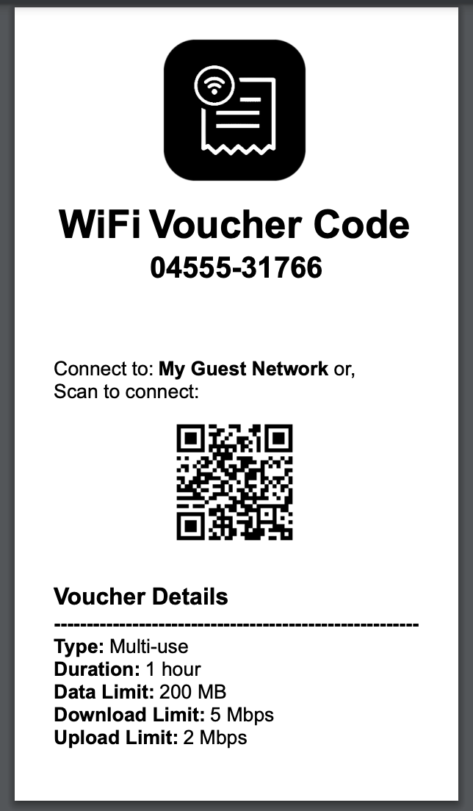

#### ESC/POS

For network-enabled ESC/POS compatible printers, provide the printer's IP address in the `PRINTERS` variable. Once configured, you can print vouchers directly to your network printer from the UniFi Voucher Site application.

Just like with PDF printing, navigate to the voucher and click on the "Print" button. The application will send the print job directly to the ESC/POS printer over the network, ensuring quick and seamless voucher printing. Make sure your printer supports ESC/POS commands and is correctly configured to accept print jobs over the network.

##### Tested Printers

- EPSON TM-T88V
- EPSON TM-T20X
- EPSON TM-T82IIIL
- Posman BTP-R880NP
- NetumScan NT-8360 / 80-V

##### Example Print

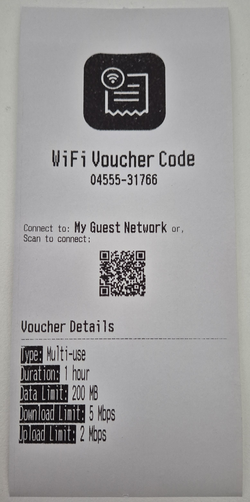

---

## Email Functionality

The UniFi Voucher Site includes a convenient email feature that allows you to send vouchers directly to users from the web interface. By configuring the SMTP settings, you can enable email sending and make it easy to distribute vouchers digitally.

### Configuration

To enable the email feature, you need to set the following environment variables with your SMTP server details:

```env
SMTP_FROM: ''
SMTP_HOST: ''
SMTP_PORT: ''
SMTP_SECURE: ''
SMTP_USERNAME: ''
SMTP_PASSWORD: ''
```

Here’s what each variable represents:

- **`SMTP_FROM`**: The sender email address that will appear in the "From" field when users receive the voucher.
- **`SMTP_HOST`**: The hostname or IP address of your SMTP server (e.g., `smtp.example.com`).
- **`SMTP_PORT`**: The port used by your SMTP server (e.g., `587` for TLS or `465` for SSL).
- **`SMTP_SECURE`**: Set to `true` if your SMTP server requires a secure connection (SSL/TLS), or `false` if it does not.
- **`SMTP_USERNAME`**: The username for authenticating with your SMTP server.
- **`SMTP_PASSWORD`**: The password for authenticating with your SMTP server.

These settings allow the application to connect to your SMTP server and send emails on your behalf.

### Usage

Once the SMTP environment variables are configured, the email feature will be available within the UniFi Voucher Site interface. After generating a voucher, you will see an option to send the voucher via email. Enter the recipient's email address, and the application will send the voucher details directly to their inbox.

### Example Email

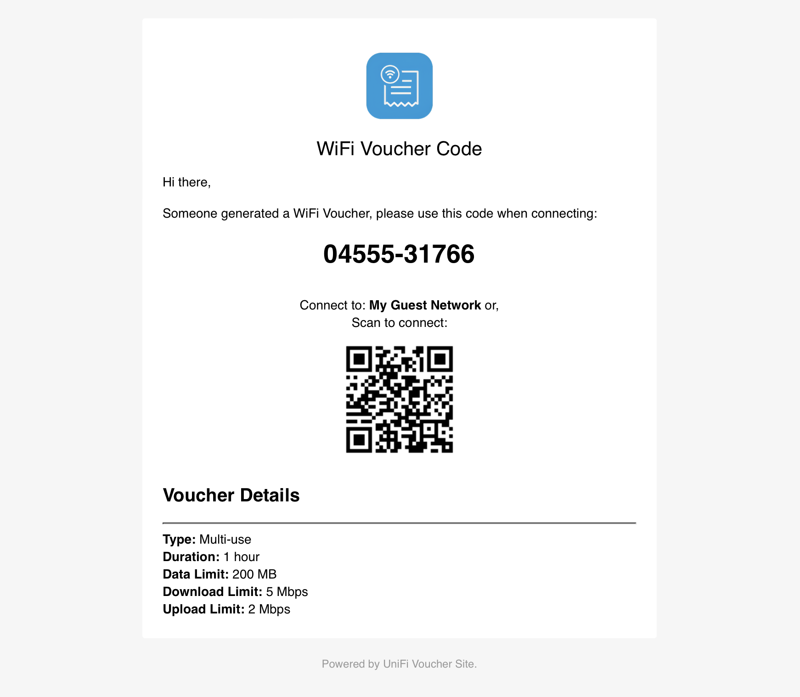

---

## Kiosk Functionality

The UniFi Voucher Site includes a **Kiosk Mode**, allowing users to generate their own vouchers via a self-service interface. This is ideal for public areas, such as cafés, hotels, and co-working spaces, where users can obtain internet access without staff intervention.

To enable the kiosk functionality, set the following environment variables:

```env
KIOSK_ENABLED: 'true'
KIOSK_VOUCHER_TYPES: '480,1,,,;'
```

### Configuration

- **`KIOSK_ENABLED`**:
    - Set to `'true'` to enable the kiosk page, making it accessible at `/kiosk`.
    - Set to `'false'` to disable the kiosk functionality.

- **`KIOSK_VOUCHER_TYPES`**: Defines the voucher properties for kiosk-generated vouchers. The format consists of the following parameters:

  ```text
  expiration_in_minutes,single_use_or_multi_use,upload_speed_limit_kbps,download_speed_limit_kbps,data_transfer_limit_MB
  ```

    - **Expiration (required)**: The validity period of the voucher in minutes. Example: `480` (8 hours).
    - **Voucher Type (required)**: Defines if the voucher is single-use or multi-use:
        - `'0'` → Multi-use (unlimited)
        - `'1'` → Single-use
        - `'N'` → Multi-use (N times) (e.g., `'3'` allows 3 uses)
    - **Upload Speed Limit (optional)**: Maximum upload speed in Kbps. Leave empty to disable.
    - **Download Speed Limit (optional)**: Maximum download speed in Kbps. Leave empty to disable.
    - **Data Transfer Limit (optional)**: Total data limit in MB. Leave empty to disable.

  > **Multiple Voucher Types:**
  > You can define multiple voucher types by separating each configuration with a semicolon (`;`).
  > Example:
  >
  > ```text
  > 480,1,,,;1440,0,512,2048,1000
  > ```
  >
  > This defines two voucher types:
  >
  > 1. A single-use voucher valid for 480 minutes with no speed or data limits.
  > 2. A multi-use (unlimited) voucher valid for 1440 minutes, limited to 512 Kbps upload, 2048 Kbps download, and 1000 MB data.

- **`KIOSK_NAME_REQUIRED`**:
    - Set to `'true'` to enable the requirement for a guest to enter their name before generating a voucher.
    - Set to `'false'` to disable to allow generation of vouchers without a name.

* **`KIOSK_PRINTER`**:

    * Set this to the IP address of an ESC/POS-compatible network printer to enable automatic voucher printing.
    * Leave this value empty to disable printing.
    * Example:

      ```text
      KIOSK_PRINTER=192.168.1.50
      ```

### Custom Branding (Logo and Background)

You can customize the appearance of the kiosk page by providing your own `logo.png` and `bg.jpg` images.

To do this, use Docker volume mappings to mount your custom assets to the `/kiosk` directory inside the container. The application will use these files (if present) instead of the default ones.

#### Example

Suppose you have your custom images in a local directory called `branding/`:

```
branding/
├── logo.png
└── bg.jpg
```

You can configure this using Docker Compose:

```yaml
services:
  unifi-voucher-site:
    image: glenndehaan/unifi-voucher-site:latest
    ports:
      - "3000:3000"
    environment:
      KIOSK_ENABLED: 'true'
      KIOSK_VOUCHER_TYPES: '480,1,,,;'
    volumes:
      - ./branding:/kiosk
```

> **Note:** Ensure `logo.png` and `bg.jpg` are valid image files. Both are optional — only override the ones you want to customize.

### Usage

Once enabled, the kiosk page is available at:

```
http://localhost:3000/kiosk
```

Users can visit this URL and generate a voucher without administrative intervention.

### Example Kiosk

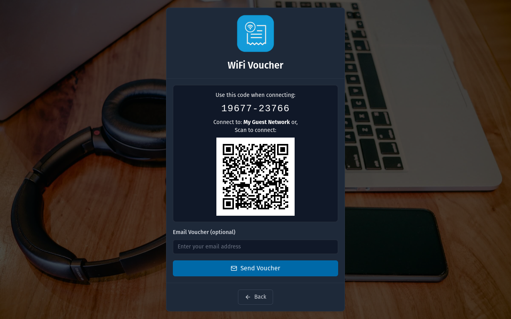

---

## Translations

The UniFi Voucher Site supports multiple languages, and we're actively working to expand the list of available translations. To facilitate this, we use **Crowdin**, a platform that allows people from around the world to help translate and improve the localization of the project.

### How to help

If you'd like to contribute by translating the UniFi Voucher Site into your language or improve existing translations, you're welcome to join our project on Crowdin. Even small contributions can make a big difference!

Simply visit our Crowdin project page by clicking the badge below:

[](https://crowdin.com/project/unifi-voucher-site)

Once you're there, you can choose your language and start contributing immediately. Crowdin provides an intuitive interface to help you suggest translations, review them, or vote on others' contributions.

### Getting Started

1. **Create a Crowdin account** (if you don't have one already).
2. **Join the UniFi Voucher Site project** by visiting our [Crowdin page](https://crowdin.com/project/unifi-voucher-site).
3. Choose the language you want to contribute to or suggest improvements for.
4. Start translating or reviewing!

Your contributions will be automatically included in the next release after review.

---

## Screenshots

### Login (Desktop)
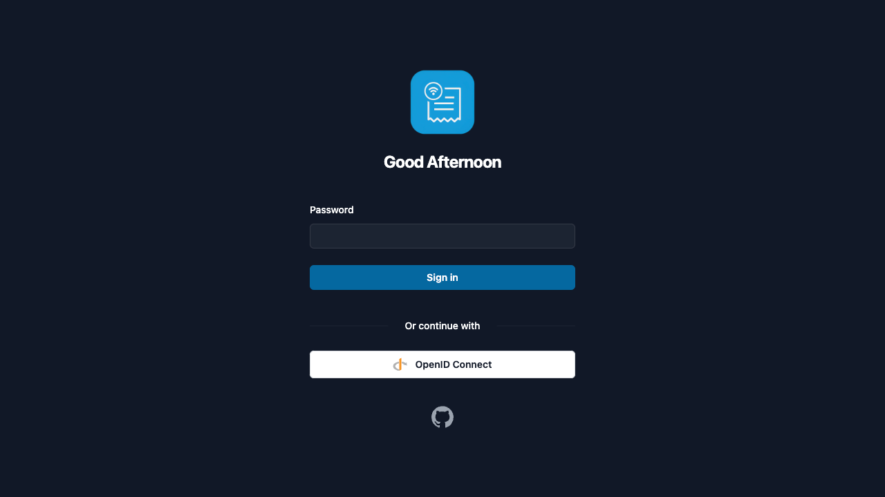

### Vouchers Overview (Desktop)


### Create Voucher (Desktop)
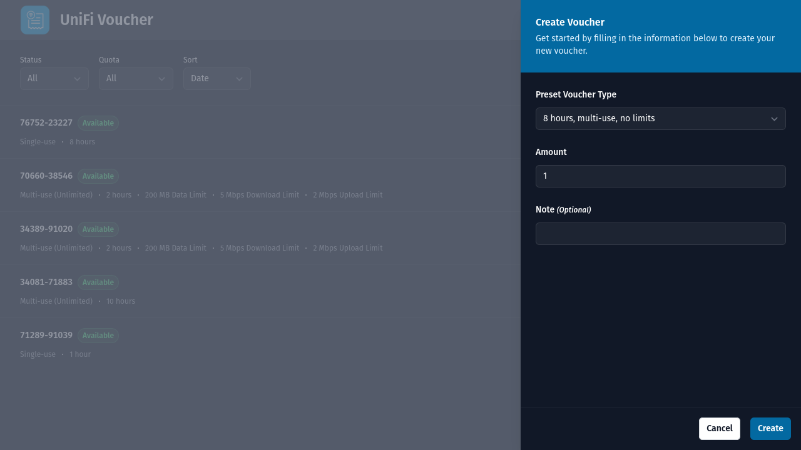

### Voucher Details (Desktop)


### Login (Mobile)
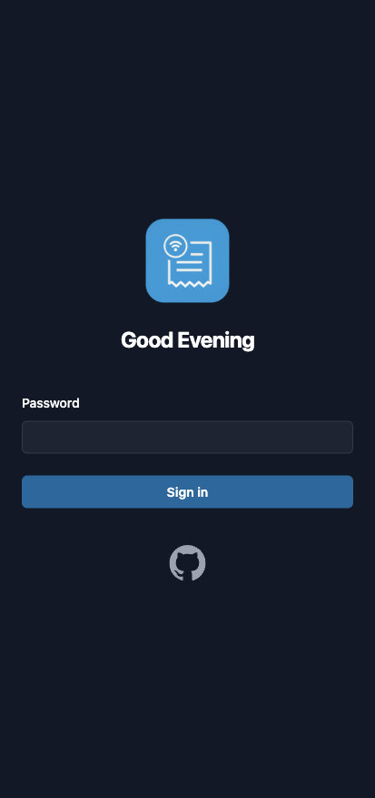

### Vouchers Overview (Mobile)
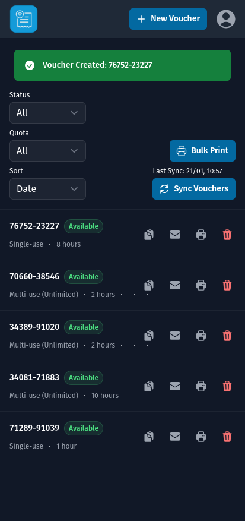

### Create Voucher (Mobile)
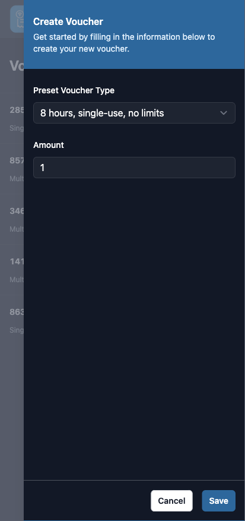

### Voucher Details (Mobile)
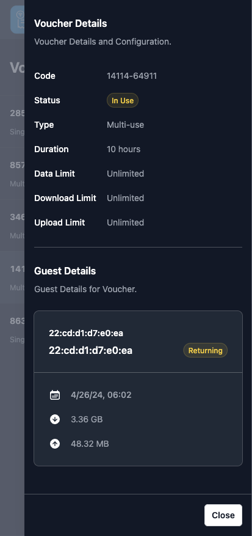

---

## Release Notes

Detailed information on the changes in each release can be found on the [GitHub Releases](https://github.com/glenndehaan/unifi-voucher-site/releases) page. It is highly recommended to review the release notes before updating or deploying a new version, especially if you are upgrading from a previous version.

---

## Migration Guide

### Migration from 6.x to 7.x

When upgrading from 6.x to 7.x, the following changes need to be made:

1. **`KIOSK_VOUCHER_TYPE` Renamed to `KIOSK_VOUCHER_TYPES`**

    * The configuration variable **`KIOSK_VOUCHER_TYPE`** has been **renamed** to **`KIOSK_VOUCHER_TYPES`** in 7.x.
    * This change supports multiple voucher types and enhances configurability.

   **Before (6.x):**

   ```env
   KIOSK_VOUCHER_TYPE='480,1,,,'
   ```

   **After (7.x):**

   ```env
   KIOSK_VOUCHER_TYPES='480,1,,,;'
   ```

    * Update your environment configuration to use the new `KIOSK_VOUCHER_TYPES` variable.
    * Ensure the values provided are valid and supported — refer to the [Kiosk Configuration](#configuration-3) for the complete list of accepted types and formatting rules.

> Make sure to remove the deprecated `KIOSK_VOUCHER_TYPE` and follow the structure outlined in the documentation to avoid misconfiguration issues during deployment.

### Migration from 5.x to 6.x

When upgrading from 5.x to 6.x, the following changes need to be made:

1. **`UI_BACK_BUTTON` Removed**

    - The `UI_BACK_BUTTON` configuration option has been **removed** in 6.x.
    - This setting is no longer used and can be safely **removed from your environment configuration**.

2. **Printer Configuration Changes**

    - The legacy printer configuration options **`PRINTER_TYPE`** and **`PRINTER_IP`** have been replaced by a single setting: **`PRINTERS`**.
    - The new format is a **comma-separated string** combining the printer type and IP address.

    **Before (5.x):**

    ```env
    PRINTER_TYPE='pdf'
    PRINTER_IP='192.168.1.10'
    ```

    **After (6.x):**

    ```env
    PRINTERS='pdf,192.168.1.10'
    ```

    - Update your configuration to use `PRINTERS` and remove the old `PRINTER_TYPE` and `PRINTER_IP` variables.

> Make sure to clean up any deprecated variables and update your printer configuration to ensure compatibility with 6.x.

### Migration from 4.x to 5.x

When upgrading from 4.x to 5.x, the following changes need to be made:

1. **Updated `/api` Endpoint Response**
    - The `/api` endpoint now returns a structured response that includes the HTTP method for each available endpoint. Update API integrations to handle the new response structure.

    **Previous Response:**

    ```json
    {
      "error": null,
      "data": {
        "message": "OK",
        "endpoints": [
          "/api",
          "/api/types",
          "/api/voucher/:type",
          "/api/vouchers"
        ]
      }
    }
    ```

    **New Response:**

    ```json
    {
      "error": null,
      "data": {
        "message": "OK",
        "endpoints": [
          { "method": "GET", "endpoint": "/api" },
          { "method": "GET", "endpoint": "/api/types" },
          { "method": "GET", "endpoint": "/api/languages" },
          { "method": "GET", "endpoint": "/api/vouchers" },
          { "method": "POST", "endpoint": "/api/voucher" }
        ]
      }
    }
    ```

2. **`/api/voucher/:type` Endpoint Replacement**
    - The **`/api/voucher/:type`** endpoint has been replaced by **`/api/voucher`**.
    - The method has changed from **`GET`** to **`POST`**.
    - The `:type` URL parameter is now passed in the **JSON body**.

    **Example Request:**

    ```http
    POST /api/voucher
    Content-Type: application/json

    {
      "type": "480,0,,,"
    }
    ```

### Migration from 3.x to 4.x

When upgrading from 3.x to 4.x, the following changes need to be made:

1. **OIDC Public Flow Removal**
    - The OIDC public flow has been removed in v4. Only the **confidential flow** is now supported.
    - Users must migrate to the confidential flow. Updated integration guides are available to help with this migration: [OIDC IdP Integration Guides](#oidc-idp-integration-guides).

2. **OIDC Endpoints Update**
    - OIDC endpoints have been moved to dedicated paths.
    - Update the IdP callback URL from **`/callback`** to **`/oidc/callback`** in your IdP configuration.

3. **Environment Variable Changes**
    - **`AUTH_OIDC_CLIENT_TYPE`** has been **removed**. It is no longer required.
    - **`AUTH_OIDC_ENABLED`** has been introduced. If you are using OIDC, you must set `AUTH_OIDC_ENABLED` to **`true`** in your environment configuration.
    - **`AUTH_INTERNAL_ENABLED`** has been introduced.
        - If you are using **internal authentication**, set `AUTH_INTERNAL_ENABLED` to **`true`**.
        - If you are using OIDC **and want to disable internal authentication**, set `AUTH_INTERNAL_ENABLED` to **`false`**.

4. **Password Variable Rename**
    - **`AUTH_PASSWORD`** has been renamed to **`AUTH_INTERNAL_PASSWORD`**.
    - Update your environment variable to use `AUTH_INTERNAL_PASSWORD` if you rely on internal authentication.

5. **Bearer Token Variable Rename**
    - **`AUTH_TOKEN`** has been replaced by **`AUTH_INTERNAL_BEARER_TOKEN`**.
    - Update your environment variable to use `AUTH_INTERNAL_BEARER_TOKEN` for api bearer token authentication.

### Migration from 2.x to 3.x

When upgrading from 2.x to 3.x, the following changes need to be made:

1. **`SECURITY_CODE`** has been replaced by **`AUTH_PASSWORD`**.
    - Update your environment variables configuration to use `AUTH_PASSWORD` instead of `SECURITY_CODE`.

2. **`DISABLE_AUTH`** has been replaced by **`AUTH_DISABLE`**.
    - Replace `DISABLE_AUTH` with `AUTH_DISABLE` in your environment variables.

3. The API bearer token now uses a dedicated variable **`AUTH_TOKEN`**.
    - Ensure that your API token is now stored under the `AUTH_TOKEN` variable and update your implementations to use this new token instead of the `SECURITY_CODE`.

### Migration from 1.x to 2.x

No migration steps are required.

### Migration from Versions Prior to v1

Versions before v1 do not have a direct migration path. If you are using a version earlier than v1, a fresh installation is required. Be sure to back up any important data before proceeding with a re-install.

---

## License

MIT
